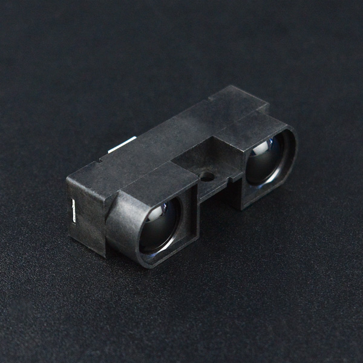

# DFRobot_IRDMSensor
- [English Version](./README.md)

GP2Y0A710K是夏普红外距离传感器家族成员之一，此型号可提供最远5.5米的探测距离，属于红外测距中的高端产品，某种程度可代替昂贵的激光测距模块，同样也拥有夏普在红外距离探测领域一贯的品质。 此传感器可以用于机器人的测距、避障以及高级的路径规划，是机器视觉及其应用领域的不错选择。



## Product Link (https://www.dfrobot.com/product-447.html)

    SKU：SEN0085

## Table of Contents

  * [Summary](#summary)
  * [Installation](#installation)
  * [Methods](#methods)
  * [Compatibility](#compatibility)
  * [History](#history)
  * [Credits](#credits)

## Summary

这个库用来获取障碍物到传感器探头的距离。

## Installation

To use this library, first download the library file, paste it into the \Arduino\libraries directory, then open the examples folder and run the demo in the folder.

## Methods

```C++
  /**
   * @fn getSensorValue
   * @brief 获取传感器返回数据
   * @return float类型，传感器返回数据
   */
  float getSensorValue(void);

  /**
   * @fn getDistance
   * @brief This is a function that converts SensorValue to distance 
   * @return float类型，converts SensorValue to distance 
   */
  float getDistance(void);
```

## Compatibility

主板               | 通过  | 未通过   | 未测试   | 备注
------------------ | :----------: | :----------: | :---------: | -----
Arduino uno        |      √       |              |             | 
Mega2560        |      √       |              |             | 
Leonardo        |      √       |              |             | 
ESP32           |      √       |              |             | 
ESP8266           |      √       |              |             | 
micro:bit        |      √       |              |             | 

## History

- 2022/09/03 - Version 1.0.0 released.

## Credits

Written by PengKaixing(kaixing@dfrobot.com), 2019. (Welcome to our [website](https://www.dfrobot.com/))


