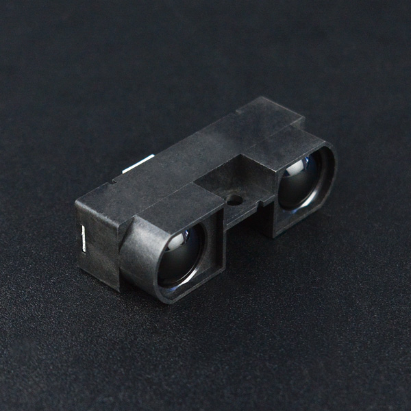

# DFRobot_IRDMSensor
- [English Version](./README.md)

GP2Y0A710K是夏普红外距离传感器家族成员之一，此型号可提供最远5.5米的探测距离，属于红外测距中的高端产品，某种程度可代替昂贵的激光测距模块，同样也拥有夏普在红外距离探测领域一贯的品质。 此传感器可以用于机器人的测距、避障以及高级的路径规划，是机器视觉及其应用领域的不错选择。




## 产品链接（https://www.dfrobot.com.cn/goods-339.html）

    SKU：SEN0085

## 目录

  * [概述](#概述)
  * [库安装](#库安装)
  * [方法](#方法)
  * [兼容性](#兼容性)
  * [历史](#历史)
  * [创作者](#创作者)

## 概述

这个库用来获取障碍物到传感器探头的距离。

## 库安装

使用此库前，请首先下载库文件，将其粘贴到\Arduino\libraries目录中，然后打开examples文件夹并在该文件夹中运行演示。

## 方法

```C++
  /**
   * @fn getSensorValue
   * @brief 获取传感器返回数据
   * @return float类型，传感器返回数据
   */
  float getSensorValue(void);

  /**
   * @fn getDistance
   * @brief This is a function that converts SensorValue to distance 
   * @return float类型，converts SensorValue to distance 
   */
  float getDistance(void);
```

## 兼容性

主板               | 通过  | 未通过   | 未测试   | 备注
------------------ | :----------: | :----------: | :---------: | -----
Arduino uno        |      √       |              |             | 
Mega2560        |      √       |              |             | 
Leonardo        |      √       |              |             | 
ESP32           |      √       |              |             | 
ESP8266           |      √       |              |             | 
micro:bit        |      √       |              |             | 


## 历史

- 2021/09/30 - 1.0.1 版本

## 创作者

Written by PengKaixing(kaixing.peng@dfrobot.com), 2019. (Welcome to our [website](https://www.dfrobot.com/))


